# 北交所录入助审系统 - 模块间时序图

## 文档说明

本文档描述了北交所录入助审系统各功能模块间的交互时序，展示了系统主要业务场景的处理流程。

**文档版本**: v1.0  
**最后更新**: 2025-11-05

---

## 1. 文件质量检测时序图

### 1.1 图片/PDF质量检测流程

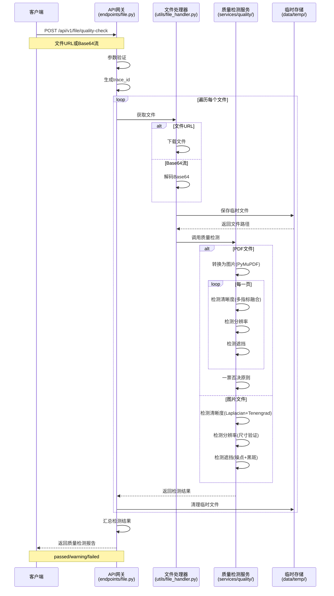
```mermaid
sequenceDiagram
    participant Client as 客户端
    participant API as API网关<br/>(endpoints/file.py)
    participant FileHandler as 文件处理器<br/>(utils/file_handler.py)
    participant QualityChecker as 质量检测服务<br/>(services/quality/)
    participant Storage as 临时存储<br/>(data/temp/)

    Client->>API: POST /api/v1/file/quality-check
    Note over Client,API: 文件URL或Base64流
    
    API->>API: 参数验证
    API->>API: 生成trace_id
    
    loop 遍历每个文件
        API->>FileHandler: 获取文件
        alt 文件URL
            FileHandler->>FileHandler: 下载文件
        else Base64流
            FileHandler->>FileHandler: 解码Base64
        end
        
        FileHandler->>Storage: 保存临时文件
        Storage-->>FileHandler: 返回文件路径
        
        FileHandler->>QualityChecker: 调用质量检测
        
        alt PDF文件
            QualityChecker->>QualityChecker: 转换为图片(PyMuPDF)
            loop 每一页
                QualityChecker->>QualityChecker: 检测清晰度(多指标融合)
                QualityChecker->>QualityChecker: 检测分辨率
                QualityChecker->>QualityChecker: 检测遮挡
            end
            QualityChecker->>QualityChecker: 一票否决原则
        else 图片文件
            QualityChecker->>QualityChecker: 检测清晰度(Laplacian+Tenengrad)
            QualityChecker->>QualityChecker: 检测分辨率(尺寸验证)
            QualityChecker->>QualityChecker: 检测遮挡(噪点+黑斑)
        end
        
        QualityChecker-->>API: 返回检测结果
        API->>Storage: 清理临时文件
    end
    
    API->>API: 汇总检测结果
    API-->>Client: 返回质量检测报告
    Note over Client,API: passed/warning/failed
```

---

## 2. 智能字段提取时序图

### 2.1 同步提取流程

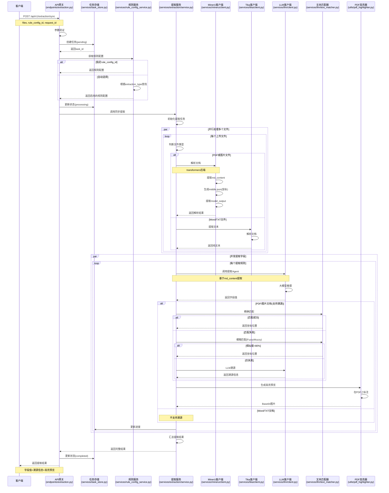
```mermaid
sequenceDiagram
    participant Client as 客户端
    participant API as API网关<br/>(endpoints/extraction.py)
    participant TaskStore as 任务存储<br/>(services/task_store.py)
    participant RuleService as 规则服务<br/>(services/rule_config_service.py)
    participant ExtractionService as 提取服务<br/>(services/extraction/service.py)
    participant MinerU as MinerU客户端<br/>(services/mineru/client.py)
    participant Tika as Tika客户端<br/>(services/tika/client.py)
    participant LLMClient as LLM客户端<br/>(services/llm/client.py)
    participant TextMatcher as 文本匹配器<br/>(services/llm/text_matcher.py)
    participant PDFHighlighter as PDF高亮器<br/>(utils/pdf_highlighter.py)

    Client->>API: POST /api/v1/extraction/sync
    Note over Client,API: files, rule_config_id, request_id
    
    API->>API: 参数验证
    API->>TaskStore: 创建任务(pending)
    TaskStore-->>API: 返回task_id
    
    API->>RuleService: 获取规则配置
    alt 指定rule_config_id
        RuleService-->>API: 返回规则配置
    else 自动选择
        RuleService->>RuleService: 根据extraction_type查找
        RuleService-->>API: 返回启用的规则配置
    end
    
    API->>TaskStore: 更新状态(processing)
    API->>ExtractionService: 调用同步提取
    
    ExtractionService->>ExtractionService: 初始化提取任务
    
    par 并行处理多个文件
        loop 每个上传文件
            ExtractionService->>ExtractionService: 判断文件类型
            
            alt PDF或图片文件
                ExtractionService->>MinerU: 解析文档
                Note over ExtractionService,MinerU: transformers后端
                MinerU->>MinerU: 提取md_content
                MinerU->>MinerU: 生成middle.json(坐标)
                MinerU->>MinerU: 提取model_output
                MinerU-->>ExtractionService: 返回解析结果
            else Word/TXT文件
                ExtractionService->>Tika: 提取文本
                Tika->>Tika: 解析文档
                Tika-->>ExtractionService: 返回纯文本
            end
        end
    end
    
    par 并发提取字段
        loop 每个提取规则
            ExtractionService->>LLMClient: 调用提取Agent
            Note over ExtractionService,LLMClient: 基于md_content提取
            LLMClient->>LLMClient: 大模型推理
            LLMClient-->>ExtractionService: 返回字段值
            
            alt PDF/图片文档(支持溯源)
                ExtractionService->>TextMatcher: 精确匹配
                alt 匹配成功
                    TextMatcher-->>ExtractionService: 返回坐标位置
                else 匹配失败
                    ExtractionService->>TextMatcher: 模糊匹配(FuzzyWuzzy)
                    alt 相似度>80%
                        TextMatcher-->>ExtractionService: 返回坐标位置
                    else 仍失败
                        ExtractionService->>LLMClient: LLM溯源
                        LLMClient-->>ExtractionService: 返回溯源信息
                    end
                end
                
                ExtractionService->>PDFHighlighter: 生成高亮预览
                PDFHighlighter->>PDFHighlighter: 在PDF上标注
                PDFHighlighter-->>ExtractionService: Base64图片
            else Word/TXT文档
                Note over ExtractionService: 不支持溯源
            end
            
            ExtractionService->>TaskStore: 更新进度
        end
    end
    
    ExtractionService->>ExtractionService: 汇总提取结果
    ExtractionService-->>API: 返回完整结果
    
    API->>TaskStore: 更新状态(completed)
    API-->>Client: 返回提取结果
    Note over Client,API: 字段值+溯源信息+高亮预览
```

### 2.2 流式提取流程

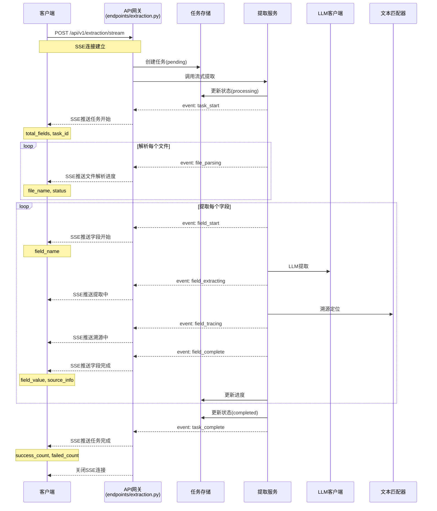
```mermaid
sequenceDiagram
    participant Client as 客户端
    participant API as API网关<br/>(endpoints/extraction.py)
    participant TaskStore as 任务存储
    participant ExtractionService as 提取服务
    participant LLMClient as LLM客户端
    participant TextMatcher as 文本匹配器

    Client->>API: POST /api/v1/extraction/stream
    Note over Client,API: SSE连接建立
    
    API->>TaskStore: 创建任务(pending)
    API->>ExtractionService: 调用流式提取
    
    ExtractionService->>TaskStore: 更新状态(processing)
    ExtractionService-->>API: event: task_start
    API-->>Client: SSE推送任务开始
    Note over Client: total_fields, task_id
    
    loop 解析每个文件
        ExtractionService-->>API: event: file_parsing
        API-->>Client: SSE推送文件解析进度
        Note over Client: file_name, status
    end
    
    loop 提取每个字段
        ExtractionService-->>API: event: field_start
        API-->>Client: SSE推送字段开始
        Note over Client: field_name
        
        ExtractionService->>LLMClient: LLM提取
        ExtractionService-->>API: event: field_extracting
        API-->>Client: SSE推送提取中
        
        ExtractionService->>TextMatcher: 溯源定位
        ExtractionService-->>API: event: field_tracing
        API-->>Client: SSE推送溯源中
        
        ExtractionService-->>API: event: field_complete
        API-->>Client: SSE推送字段完成
        Note over Client: field_value, source_info
        
        ExtractionService->>TaskStore: 更新进度
    end
    
    ExtractionService->>TaskStore: 更新状态(completed)
    ExtractionService-->>API: event: task_complete
    API-->>Client: SSE推送任务完成
    Note over Client: success_count, failed_count
    
    API-->>Client: 关闭SSE连接
```

---

## 3. 任务管理时序图

### 3.1 任务查询流程

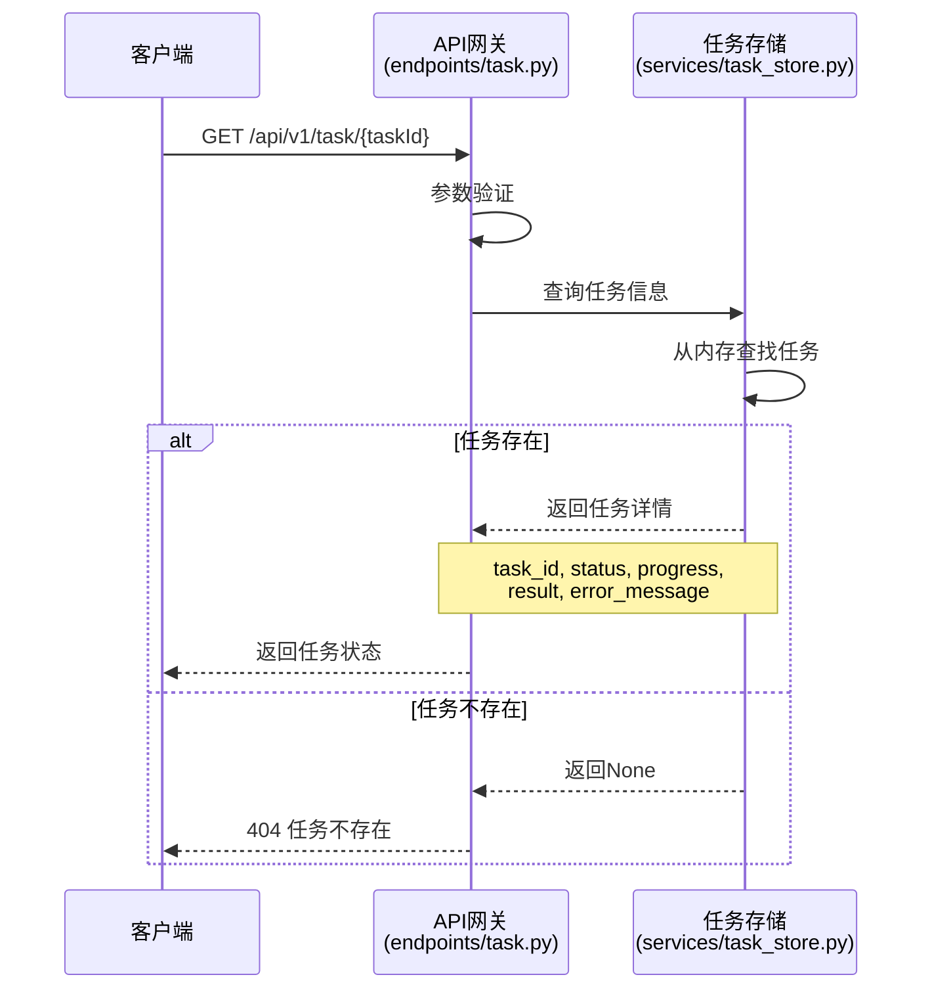
```mermaid
sequenceDiagram
    participant Client as 客户端
    participant API as API网关<br/>(endpoints/task.py)
    participant TaskStore as 任务存储<br/>(services/task_store.py)

    Client->>API: GET /api/v1/task/{taskId}
    API->>API: 参数验证
    
    API->>TaskStore: 查询任务信息
    TaskStore->>TaskStore: 从内存查找任务
    
    alt 任务存在
        TaskStore-->>API: 返回任务详情
        Note over TaskStore,API: task_id, status, progress,<br/>result, error_message
        API-->>Client: 返回任务状态
    else 任务不存在
        TaskStore-->>API: 返回None
        API-->>Client: 404 任务不存在
    end
```

### 3.2 任务取消流程

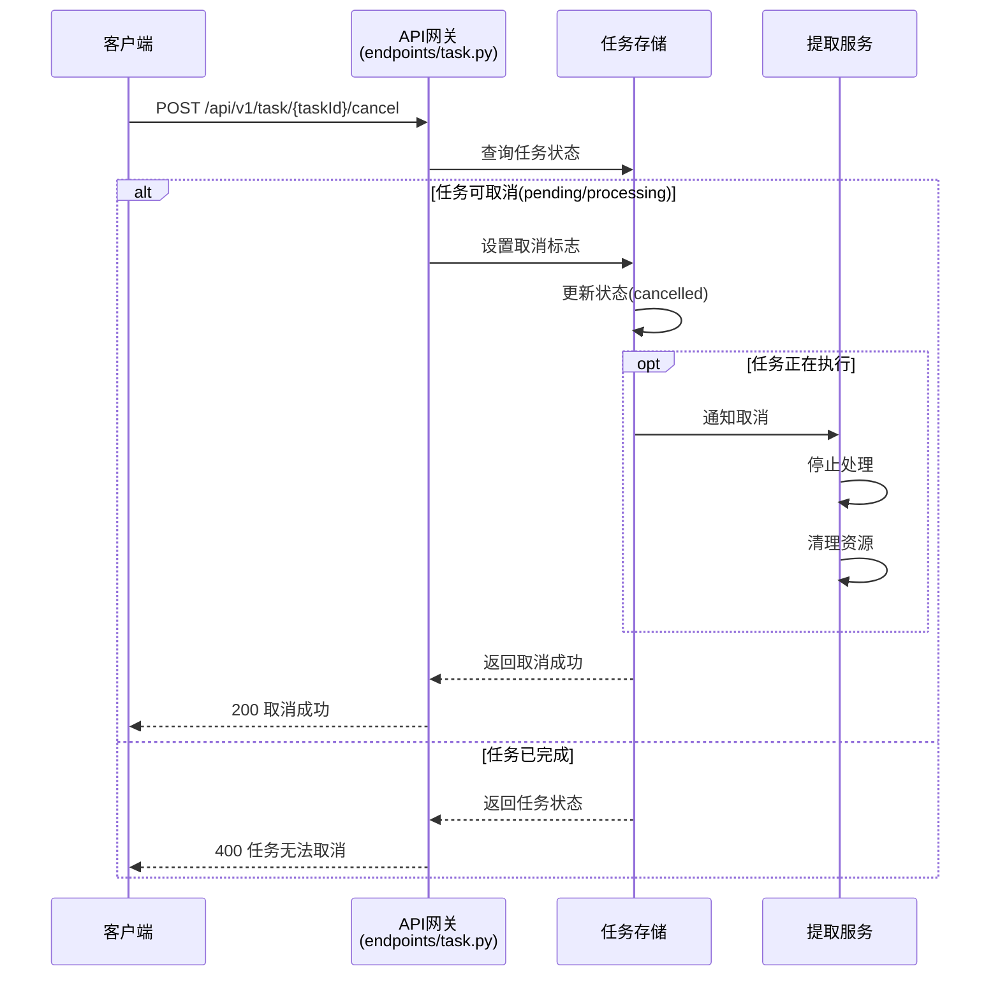
```mermaid
sequenceDiagram
    participant Client as 客户端
    participant API as API网关<br/>(endpoints/task.py)
    participant TaskStore as 任务存储
    participant ExtractionService as 提取服务

    Client->>API: POST /api/v1/task/{taskId}/cancel
    API->>TaskStore: 查询任务状态
    
    alt 任务可取消(pending/processing)
        API->>TaskStore: 设置取消标志
        TaskStore->>TaskStore: 更新状态(cancelled)
        
        opt 任务正在执行
            TaskStore->>ExtractionService: 通知取消
            ExtractionService->>ExtractionService: 停止处理
            ExtractionService->>ExtractionService: 清理资源
        end
        
        TaskStore-->>API: 返回取消成功
        API-->>Client: 200 取消成功
    else 任务已完成
        TaskStore-->>API: 返回任务状态
        API-->>Client: 400 任务无法取消
    end
```

### 3.3 任务自动清理流程

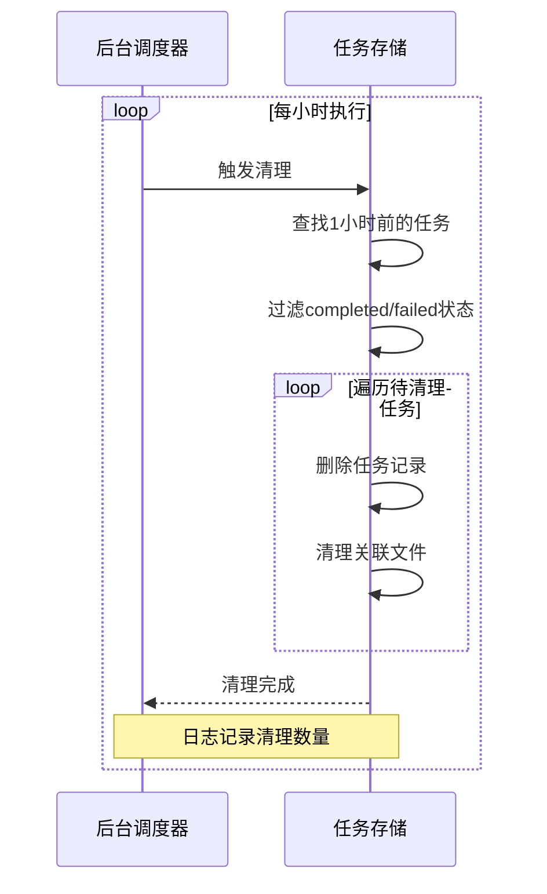
```mermaid
sequenceDiagram
    participant Scheduler as 后台调度器
    participant TaskStore as 任务存储

    loop 每小时执行
        Scheduler->>TaskStore: 触发清理
        TaskStore->>TaskStore: 查找1小时前的任务
        TaskStore->>TaskStore: 过滤completed/failed状态
        
        loop 遍历待清理任务
            TaskStore->>TaskStore: 删除任务记录
            TaskStore->>TaskStore: 清理关联文件
        end
        
        TaskStore-->>Scheduler: 清理完成
        Note over Scheduler,TaskStore: 日志记录清理数量
    end
```

---

## 4. 规则配置管理时序图

### 4.1 创建规则配置流程(Web界面)

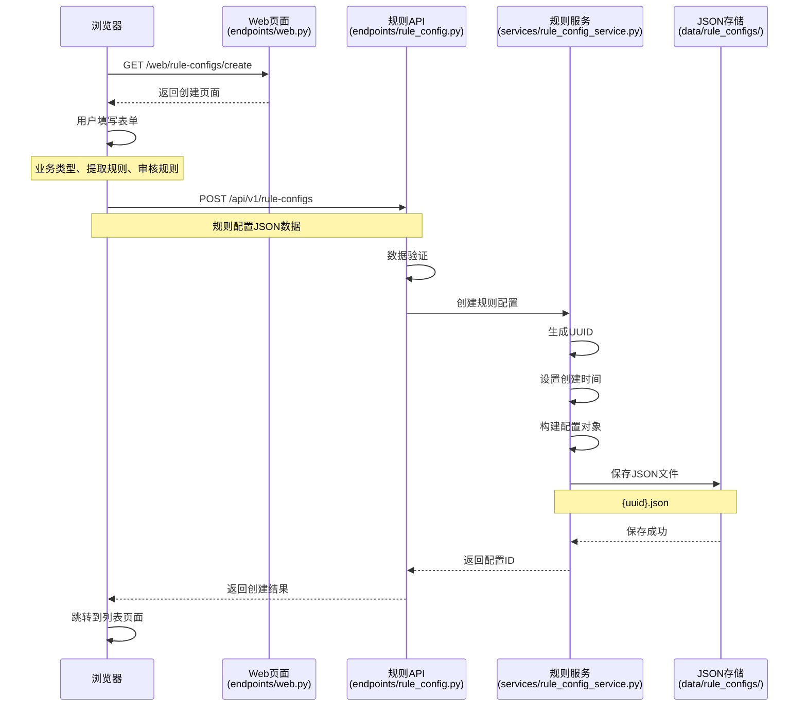
```mermaid
sequenceDiagram
    participant Browser as 浏览器
    participant WebAPI as Web页面<br/>(endpoints/web.py)
    participant RuleAPI as 规则API<br/>(endpoints/rule_config.py)
    participant RuleService as 规则服务<br/>(services/rule_config_service.py)
    participant Storage as JSON存储<br/>(data/rule_configs/)

    Browser->>WebAPI: GET /web/rule-configs/create
    WebAPI-->>Browser: 返回创建页面
    
    Browser->>Browser: 用户填写表单
    Note over Browser: 业务类型、提取规则、审核规则
    
    Browser->>RuleAPI: POST /api/v1/rule-configs
    Note over Browser,RuleAPI: 规则配置JSON数据
    
    RuleAPI->>RuleAPI: 数据验证
    RuleAPI->>RuleService: 创建规则配置
    
    RuleService->>RuleService: 生成UUID
    RuleService->>RuleService: 设置创建时间
    RuleService->>RuleService: 构建配置对象
    
    RuleService->>Storage: 保存JSON文件
    Note over RuleService,Storage: {uuid}.json
    Storage-->>RuleService: 保存成功
    
    RuleService-->>RuleAPI: 返回配置ID
    RuleAPI-->>Browser: 返回创建结果
    Browser->>Browser: 跳转到列表页面
```

### 4.2 查询规则配置流程

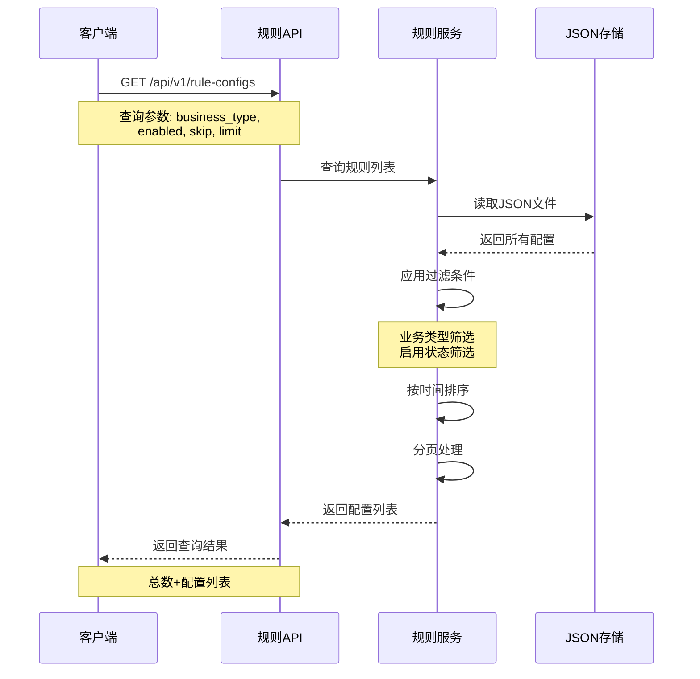
```mermaid
sequenceDiagram
    participant Client as 客户端
    participant RuleAPI as 规则API
    participant RuleService as 规则服务
    participant Storage as JSON存储

    Client->>RuleAPI: GET /api/v1/rule-configs
    Note over Client,RuleAPI: 查询参数: business_type,<br/>enabled, skip, limit
    
    RuleAPI->>RuleService: 查询规则列表
    
    RuleService->>Storage: 读取JSON文件
    Storage-->>RuleService: 返回所有配置
    
    RuleService->>RuleService: 应用过滤条件
    Note over RuleService: 业务类型筛选<br/>启用状态筛选
    
    RuleService->>RuleService: 按时间排序
    RuleService->>RuleService: 分页处理
    
    RuleService-->>RuleAPI: 返回配置列表
    RuleAPI-->>Client: 返回查询结果
    Note over Client,RuleAPI: 总数+配置列表
```

### 4.3 更新规则配置流程

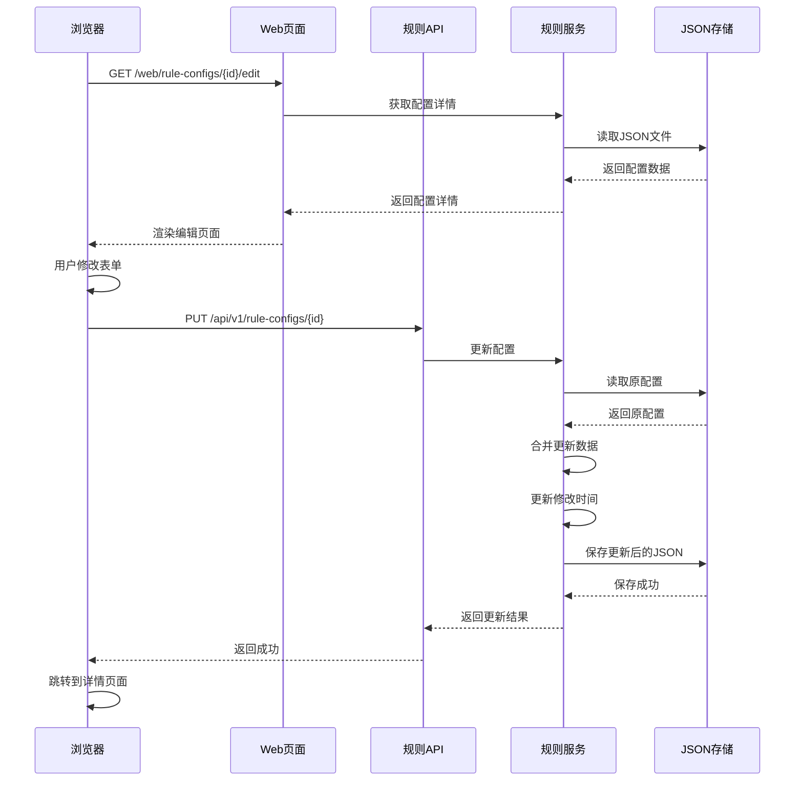
```mermaid
sequenceDiagram
    participant Browser as 浏览器
    participant WebAPI as Web页面
    participant RuleAPI as 规则API
    participant RuleService as 规则服务
    participant Storage as JSON存储

    Browser->>WebAPI: GET /web/rule-configs/{id}/edit
    WebAPI->>RuleService: 获取配置详情
    RuleService->>Storage: 读取JSON文件
    Storage-->>RuleService: 返回配置数据
    RuleService-->>WebAPI: 返回配置详情
    WebAPI-->>Browser: 渲染编辑页面
    
    Browser->>Browser: 用户修改表单
    Browser->>RuleAPI: PUT /api/v1/rule-configs/{id}
    
    RuleAPI->>RuleService: 更新配置
    RuleService->>Storage: 读取原配置
    Storage-->>RuleService: 返回原配置
    
    RuleService->>RuleService: 合并更新数据
    RuleService->>RuleService: 更新修改时间
    
    RuleService->>Storage: 保存更新后的JSON
    Storage-->>RuleService: 保存成功
    
    RuleService-->>RuleAPI: 返回更新结果
    RuleAPI-->>Browser: 返回成功
    Browser->>Browser: 跳转到详情页面
```

### 4.4 添加提取/审核规则流程

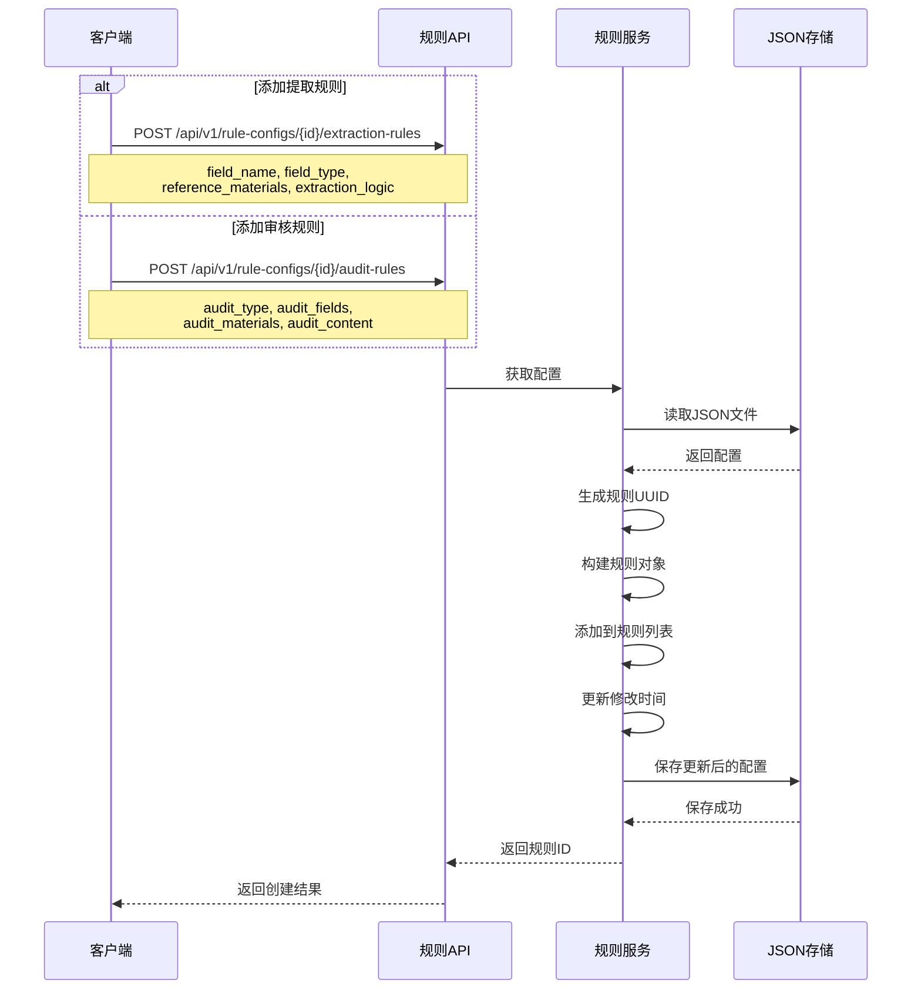
```mermaid
sequenceDiagram
    participant Client as 客户端
    participant RuleAPI as 规则API
    participant RuleService as 规则服务
    participant Storage as JSON存储

    alt 添加提取规则
        Client->>RuleAPI: POST /api/v1/rule-configs/{id}/extraction-rules
        Note over Client,RuleAPI: field_name, field_type,<br/>reference_materials, extraction_logic
    else 添加审核规则
        Client->>RuleAPI: POST /api/v1/rule-configs/{id}/audit-rules
        Note over Client,RuleAPI: audit_type, audit_fields,<br/>audit_materials, audit_content
    end
    
    RuleAPI->>RuleService: 获取配置
    RuleService->>Storage: 读取JSON文件
    Storage-->>RuleService: 返回配置
    
    RuleService->>RuleService: 生成规则UUID
    RuleService->>RuleService: 构建规则对象
    RuleService->>RuleService: 添加到规则列表
    RuleService->>RuleService: 更新修改时间
    
    RuleService->>Storage: 保存更新后的配置
    Storage-->>RuleService: 保存成功
    
    RuleService-->>RuleAPI: 返回规则ID
    RuleAPI-->>Client: 返回创建结果
```

---

## 5. 智能助审时序图(规划中)

### 5.1 字段审核流程(规划)

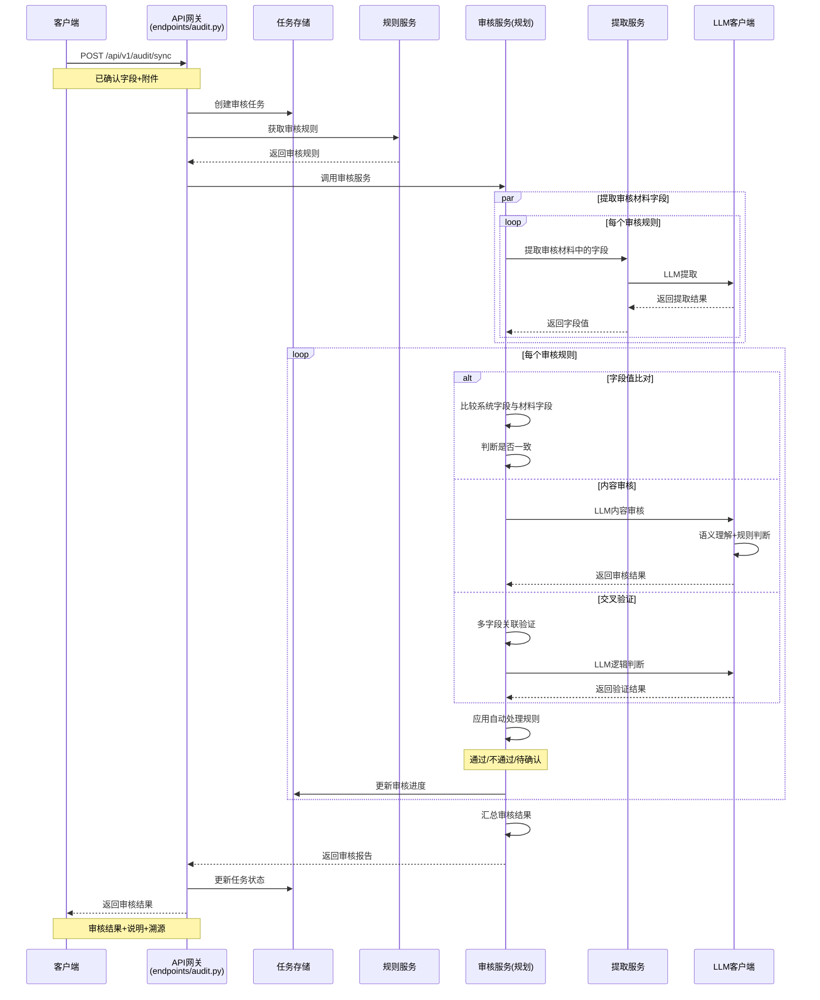
```mermaid
sequenceDiagram
    participant Client as 客户端
    participant API as API网关<br/>(endpoints/audit.py)
    participant TaskStore as 任务存储
    participant RuleService as 规则服务
    participant AuditService as 审核服务(规划)
    participant ExtractionService as 提取服务
    participant LLMClient as LLM客户端

    Client->>API: POST /api/v1/audit/sync
    Note over Client,API: 已确认字段+附件
    
    API->>TaskStore: 创建审核任务
    API->>RuleService: 获取审核规则
    RuleService-->>API: 返回审核规则
    
    API->>AuditService: 调用审核服务
    
    par 提取审核材料字段
        loop 每个审核规则
            AuditService->>ExtractionService: 提取审核材料中的字段
            ExtractionService->>LLMClient: LLM提取
            LLMClient-->>ExtractionService: 返回提取结果
            ExtractionService-->>AuditService: 返回字段值
        end
    end
    
    loop 每个审核规则
        alt 字段值比对
            AuditService->>AuditService: 比较系统字段与材料字段
            AuditService->>AuditService: 判断是否一致
        else 内容审核
            AuditService->>LLMClient: LLM内容审核
            LLMClient->>LLMClient: 语义理解+规则判断
            LLMClient-->>AuditService: 返回审核结果
        else 交叉验证
            AuditService->>AuditService: 多字段关联验证
            AuditService->>LLMClient: LLM逻辑判断
            LLMClient-->>AuditService: 返回验证结果
        end
        
        AuditService->>AuditService: 应用自动处理规则
        Note over AuditService: 通过/不通过/待确认
        
        AuditService->>TaskStore: 更新审核进度
    end
    
    AuditService->>AuditService: 汇总审核结果
    AuditService-->>API: 返回审核报告
    
    API->>TaskStore: 更新任务状态
    API-->>Client: 返回审核结果
    Note over Client,API: 审核结果+说明+溯源
```

---

## 6. 系统初始化与健康检查

### 6.1 系统启动流程

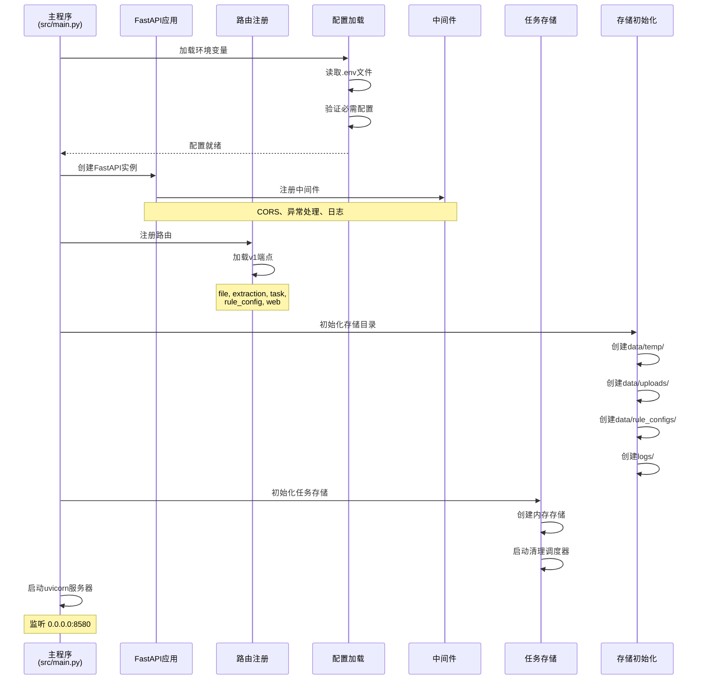
```mermaid
sequenceDiagram
    participant Main as 主程序<br/>(src/main.py)
    participant App as FastAPI应用
    participant Router as 路由注册
    participant Config as 配置加载
    participant Middleware as 中间件
    participant TaskStore as 任务存储
    participant Storage as 存储初始化

    Main->>Config: 加载环境变量
    Config->>Config: 读取.env文件
    Config->>Config: 验证必需配置
    Config-->>Main: 配置就绪
    
    Main->>App: 创建FastAPI实例
    App->>Middleware: 注册中间件
    Note over App,Middleware: CORS、异常处理、日志
    
    Main->>Router: 注册路由
    Router->>Router: 加载v1端点
    Note over Router: file, extraction, task,<br/>rule_config, web
    
    Main->>Storage: 初始化存储目录
    Storage->>Storage: 创建data/temp/
    Storage->>Storage: 创建data/uploads/
    Storage->>Storage: 创建data/rule_configs/
    Storage->>Storage: 创建logs/
    
    Main->>TaskStore: 初始化任务存储
    TaskStore->>TaskStore: 创建内存存储
    TaskStore->>TaskStore: 启动清理调度器
    
    Main->>Main: 启动uvicorn服务器
    Note over Main: 监听 0.0.0.0:8580
```

### 6.2 健康检查流程

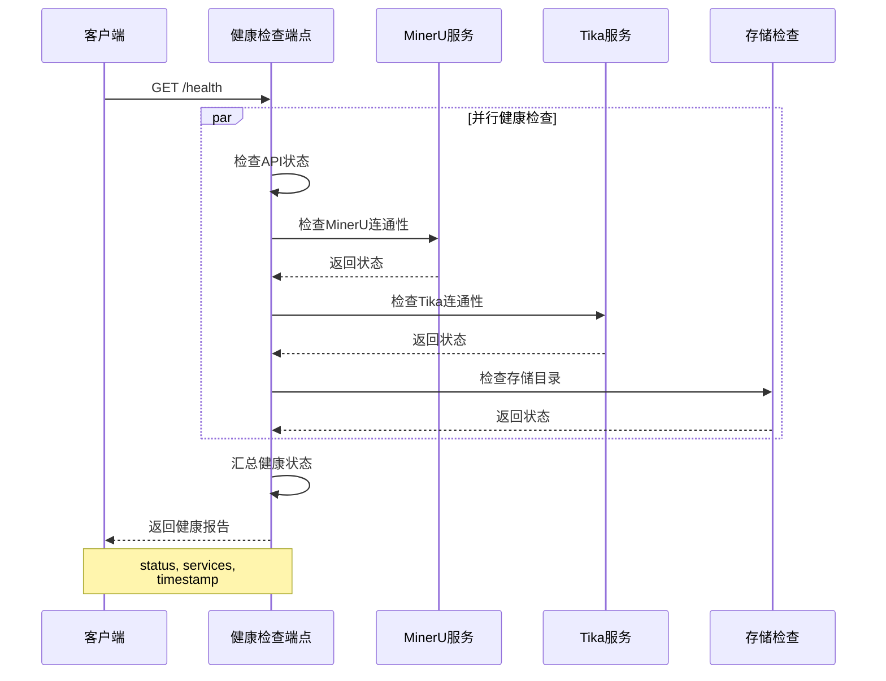
```mermaid
sequenceDiagram
    participant Client as 客户端
    participant API as 健康检查端点
    participant MinerU as MinerU服务
    participant Tika as Tika服务
    participant Storage as 存储检查

    Client->>API: GET /health
    
    par 并行健康检查
        API->>API: 检查API状态
        API->>MinerU: 检查MinerU连通性
        MinerU-->>API: 返回状态
        API->>Tika: 检查Tika连通性
        Tika-->>API: 返回状态
        API->>Storage: 检查存储目录
        Storage-->>API: 返回状态
    end
    
    API->>API: 汇总健康状态
    API-->>Client: 返回健康报告
    Note over Client,API: status, services,<br/>timestamp
```

---

## 7. 错误处理与重试机制

### 7.1 提取失败重试流程

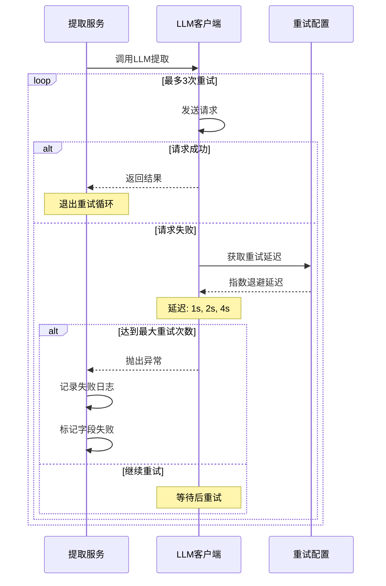
```mermaid
sequenceDiagram
    participant ExtractionService as 提取服务
    participant LLMClient as LLM客户端
    participant Config as 重试配置

    ExtractionService->>LLMClient: 调用LLM提取
    
    loop 最多3次重试
        LLMClient->>LLMClient: 发送请求
        
        alt 请求成功
            LLMClient-->>ExtractionService: 返回结果
            Note over ExtractionService: 退出重试循环
        else 请求失败
            LLMClient->>Config: 获取重试延迟
            Config-->>LLMClient: 指数退避延迟
            Note over LLMClient: 延迟: 1s, 2s, 4s
            
            alt 达到最大重试次数
                LLMClient-->>ExtractionService: 抛出异常
                ExtractionService->>ExtractionService: 记录失败日志
                ExtractionService->>ExtractionService: 标记字段失败
            else 继续重试
                Note over LLMClient: 等待后重试
            end
        end
    end
```

---

## 8. 文件类型路由流程

### 8.1 智能文档解析路由

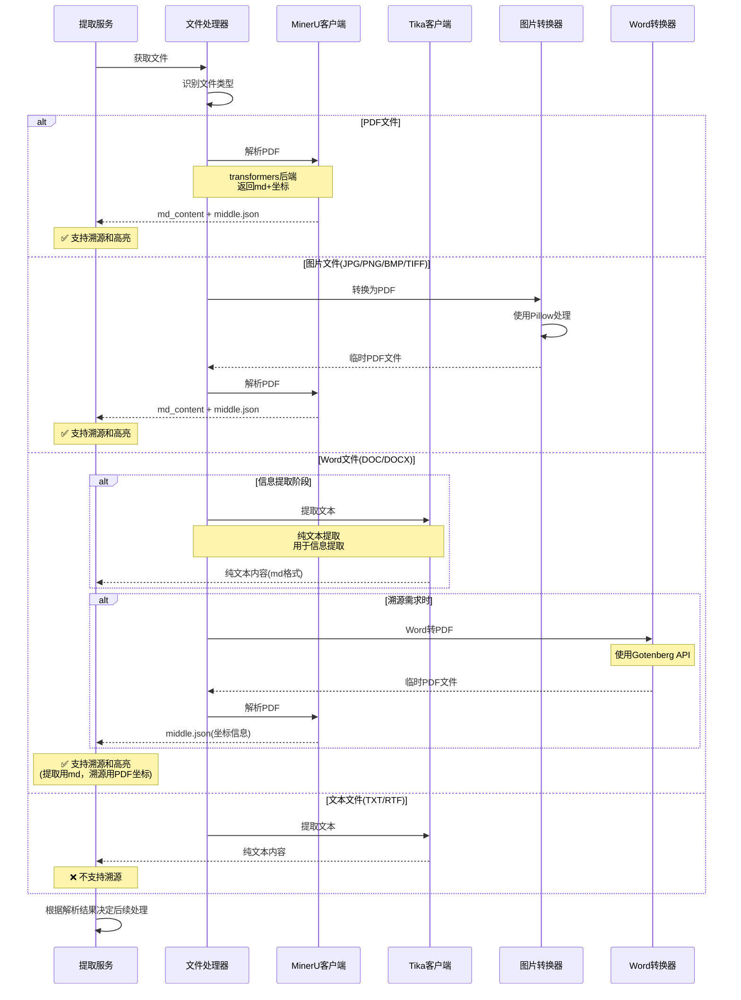
```mermaid
sequenceDiagram
    participant ExtractionService as 提取服务
    participant FileHandler as 文件处理器
    participant MinerU as MinerU客户端
    participant Tika as Tika客户端
    participant ImageConverter as 图片转换器
    participant WordConverter as Word转换器

    ExtractionService->>FileHandler: 获取文件
    FileHandler->>FileHandler: 识别文件类型
    
    alt PDF文件
        FileHandler->>MinerU: 解析PDF
        Note over FileHandler,MinerU: transformers后端<br/>返回md+坐标
        MinerU-->>ExtractionService: md_content + middle.json
        Note over ExtractionService: ✅ 支持溯源和高亮
        
    else 图片文件(JPG/PNG/BMP/TIFF)
        FileHandler->>ImageConverter: 转换为PDF
        ImageConverter->>ImageConverter: 使用Pillow处理
        ImageConverter-->>FileHandler: 临时PDF文件
        
        FileHandler->>MinerU: 解析PDF
        MinerU-->>ExtractionService: md_content + middle.json
        Note over ExtractionService: ✅ 支持溯源和高亮
        
    else Word文件(DOC/DOCX)
        alt 信息提取阶段
            FileHandler->>Tika: 提取文本
            Note over FileHandler,Tika: 纯文本提取<br/>用于信息提取
            Tika-->>ExtractionService: 纯文本内容(md格式)
        end
        
        alt 溯源需求时
            FileHandler->>WordConverter: Word转PDF
            Note over WordConverter: 使用Gotenberg API
            WordConverter-->>FileHandler: 临时PDF文件
            FileHandler->>MinerU: 解析PDF
            MinerU-->>ExtractionService: middle.json(坐标信息)
        end
        
        Note over ExtractionService: ✅ 支持溯源和高亮<br/>(提取用md，溯源用PDF坐标)
        
    else 文本文件(TXT/RTF)
        FileHandler->>Tika: 提取文本
        Tika-->>ExtractionService: 纯文本内容
        Note over ExtractionService: ❌ 不支持溯源
    end
    
    ExtractionService->>ExtractionService: 根据解析结果决定后续处理
```

---

## 9. 并发控制流程

### 9.1 字段并发提取流程

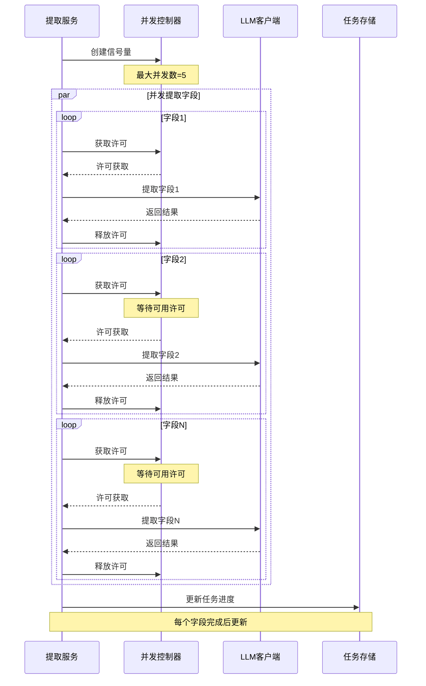
```mermaid
sequenceDiagram
    participant ExtractionService as 提取服务
    participant Semaphore as 并发控制器
    participant LLMClient as LLM客户端
    participant TaskStore as 任务存储

    ExtractionService->>Semaphore: 创建信号量
    Note over Semaphore: 最大并发数=5
    
    par 并发提取字段
        loop 字段1
            ExtractionService->>Semaphore: 获取许可
            Semaphore-->>ExtractionService: 许可获取
            ExtractionService->>LLMClient: 提取字段1
            LLMClient-->>ExtractionService: 返回结果
            ExtractionService->>Semaphore: 释放许可
        end
        
        loop 字段2
            ExtractionService->>Semaphore: 获取许可
            Note over Semaphore: 等待可用许可
            Semaphore-->>ExtractionService: 许可获取
            ExtractionService->>LLMClient: 提取字段2
            LLMClient-->>ExtractionService: 返回结果
            ExtractionService->>Semaphore: 释放许可
        end
        
        loop 字段N
            ExtractionService->>Semaphore: 获取许可
            Note over Semaphore: 等待可用许可
            Semaphore-->>ExtractionService: 许可获取
            ExtractionService->>LLMClient: 提取字段N
            LLMClient-->>ExtractionService: 返回结果
            ExtractionService->>Semaphore: 释放许可
        end
    end
    
    ExtractionService->>TaskStore: 更新任务进度
    Note over ExtractionService,TaskStore: 每个字段完成后更新
```

---

## 附录

### A. 模块说明

| 模块 | 路径 | 说明 |
|-----|------|------|
| API网关 | `src/api/v1/endpoints/` | FastAPI路由端点 |
| 提取服务 | `src/services/extraction/` | 字段提取核心逻辑 |
| 质量检测 | `src/services/quality/` | 文件质量检测 |
| LLM客户端 | `src/services/llm/` | 灵搭Agent API集成 |
| MinerU客户端 | `src/services/mineru/` | 文档解析服务 |
| Tika客户端 | `src/services/tika/` | 文本提取服务 |
| 任务存储 | `src/services/task_store.py` | 任务状态管理 |
| 规则服务 | `src/services/rule_config_service.py` | 规则配置管理 |
| 文件处理器 | `src/utils/file_handler.py` | 文件下载和处理 |
| 图片转换器 | `src/utils/image_converter.py` | 图片转PDF |
| Word转换器 | `src/utils/word_converter.py` | Word转PDF |
| PDF高亮器 | `src/utils/pdf_highlighter.py` | PDF标注生成 |

### B. 外部服务依赖

| 服务/库 | 地址/版本 | 用途 |
|-----|------|------|
| MinerU API | http://35.241.77.81:8001 | PDF/图片文档解析，提取坐标信息 |
| Apache Tika | http://35.241.77.81:7581 | Word/TXT文本提取 |
| Gotenberg API | http://101.126.54.157:7582 | Word文档转PDF（用于溯源） |
| 灵搭Agent API | 配置文件指定 | LLM推理服务 |

### C. 数据流向说明

1. **文件上传**: 客户端 → API → 临时存储
2. **文档解析**: 
   - PDF/图片: 临时存储 → MinerU → md_content + middle.json
   - Word文档: 
     - 提取阶段: 临时存储 → Tika → 文本内容
     - 溯源阶段: 临时存储 → Gotenberg → PDF → MinerU → middle.json
   - 文本文档: 临时存储 → Tika → 文本内容（不支持溯源）
3. **字段提取**: 解析结果 → LLM → 提取结果
4. **溯源定位**: 提取结果 + middle.json → 文本匹配/LLM溯源 → 坐标信息
5. **高亮生成**: 坐标信息 + 原PDF/转换PDF → PDF高亮 → Base64图片
6. **结果返回**: 提取结果 + 溯源信息 + 预览图 → 客户端

---

**文档说明**：
- 本文档使用mermaid语法绘制时序图
- 实线箭头表示同步调用，虚线箭头表示返回
- `par`块表示并行处理，`loop`块表示循环处理
- `alt`块表示条件分支，`opt`块表示可选步骤
- 注释框(Note)提供额外的说明信息

**查看方式**：
- 在支持mermaid的Markdown编辑器中查看（如Typora、VS Code + Mermaid插件）
- 在线预览：https://mermaid.live/
- GitHub/GitLab自动渲染

